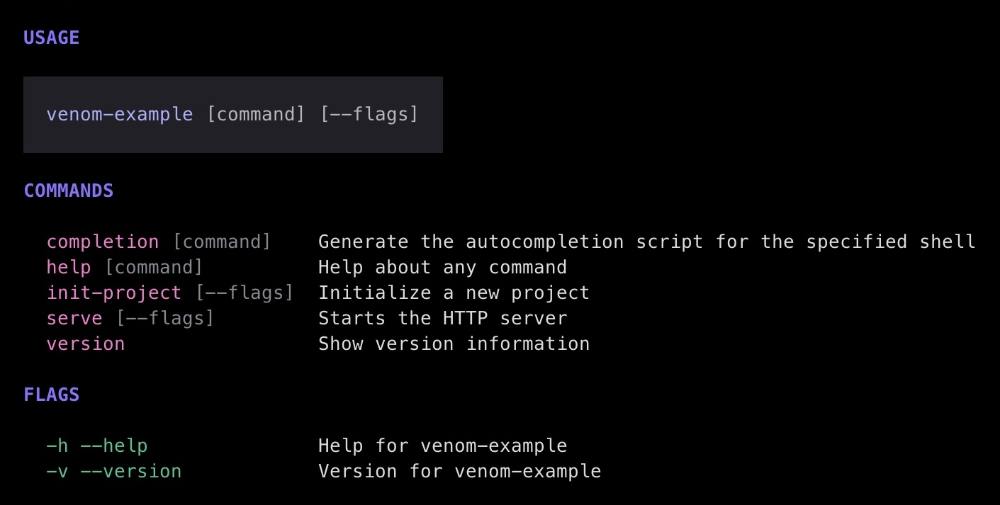

# Venom

Declarative CLI generation for Go. Write functions, get commands.


```go
package main

import (
	"context"
	"fmt"

	"github.com/shakefu/venom"
)

//go:generate venom generate

// @cmd starts the HTTP server
func serve(
	ctx context.Context,
	port int,    // @short p @default 8080 @desc "port to listen on"
	host string, // @default localhost @desc "host to bind"
) error {
	fmt.Printf("Listening on %s:%d\n", host, port)
	return nil
}

// @cmd initialize a new project
func initProject(
	ctx context.Context,
	dir string, // @default . @desc "directory to initialize"
) error {
	fmt.Printf("Initializing project in %s\n", dir)
	return nil
}

// @cmd show version information
func version(ctx context.Context) error {
	fmt.Println("venom-example v0.1.0")
	return nil
}

func main() {
	venom.Execute(serve, initProject, version)
}
```

That's it. No structs, no builders, no boilerplate. Run `go generate` and you get:



```
$ venom-example --help

  USAGE

    venom-example [command] [--flags]

  COMMANDS

    completion [command]    Generate the autocompletion script for the specified shell
    help [command]          Help about any command
    init-project [--flags]  Initialize a new project
    serve [--flags]         Starts the HTTP server
    version                 Show version information

  FLAGS

    -h --help               Help for venom-example
    -v --version            Version for venom-example
```

```
$ venom-example serve -p 3000 --host 0.0.0.0
Listening on 0.0.0.0:3000
```

## How it works

1. Write plain Go functions with annotations in comments
2. Add `//go:generate venom generate` to your package
3. Run `go generate` to produce registration code
4. Call `venom.Execute(...)` in main

Functions become commands. Parameters become flags. Annotations control the CLI behavior:

| Annotation | Where | Example |
|------------|-------|---------|
| `@cmd` | Function doc comment | `// @cmd starts the server` |
| `@desc` | Parameter comment | `// @desc "port to listen on"` |
| `@default` | Parameter comment | `// @default 8080` |
| `@short` | Parameter comment | `// @short p` |
| `@required` | Parameter comment | `// @required` |

## Naming conventions

Venom derives CLI names from Go names automatically:

| Go function | Command |
|-------------|---------|
| `serve` | `serve` |
| `initProject` | `init-project` |
| `serve_tls` | `serve tls` (subcommand) |

| Go parameter | Flag |
|--------------|------|
| `port` | `--port` |
| `serverPort` | `--server-port` |
| `useHTTPS` | `--use-https` |

## Configuration resolution

Flag values are resolved from multiple sources in priority order:

1. **CLI flag** — `--port 3000`
2. **Environment variable** — `VENOM_EXAMPLE_PORT=3000`
3. **Config file** — `.venom-example` (YAML, TOML, or JSON)
4. **Default** — `@default` annotation value
5. **Zero value** — type default (`0`, `""`, `false`)

## Custom exit codes

Command functions return `error`. By default, errors exit with code 1. Implement `ErrorCode() int` for custom exit codes:

```go
type ValidationError struct {
	Message string
}

func (e *ValidationError) Error() string   { return e.Message }
func (e *ValidationError) ErrorCode() int  { return 2 }
```

## Installation

```bash
go install github.com/shakefu/venom/cmd/venom@latest
```

Then in your project:

```bash
go get github.com/shakefu/venom
```

## Usage

Add a `go:generate` directive to your package and run `go generate`:

```go
//go:generate venom generate
```

```bash
go generate ./...
```

This produces a `venom_gen.go` file with `init()` registrations. Commit this file — it's part of your build.

### App configuration

For more control, use `venom.New()`:

```go
app := venom.New(
	venom.WithName("venom-example"),
	venom.WithVersion("1.0.0"),
	venom.WithEnvPrefix("VENOM_EXAMPLE"),
	venom.WithConfigName(".venom-example"),
	venom.WithConfigPaths(".", "$HOME"),
)
app.Execute(serve, initProject, version)
```

## Documentation

- [Allium specification](venom.allium) — formal domain specification

## Contributing

This project uses:

- [Conventional commits](https://www.conventionalcommits.org/) for commit messages
- [prek](https://github.com/j178/prek) for pre-commit hooks
- [cocogitto](https://docs.cocogitto.io/) for semantic releases

```bash
script/setup    # set up after cloning
script/test     # run tests
script/lint     # run linters
script/build    # build the project
```

## License

MIT
